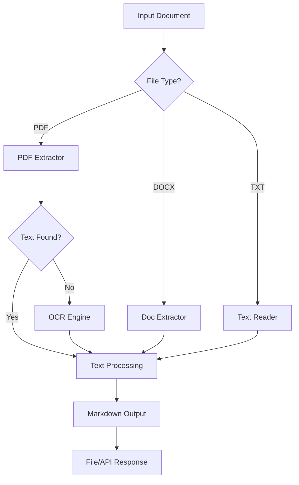

# Scrapr - Document Extraction Tool

## Overview
Scrapr is a powerful document extraction tool that can process PDFs, Word documents, and text files. It features intelligent OCR fallback for scanned documents and provides both CLI and API interfaces.

## Features
- ✅ PDF text extraction with multiple methods (PyPDF2, pdfplumber, PyMuPDF)
- ✅ OCR support for scanned documents
- ✅ Word document (.doc, .docx) extraction
- ✅ Plain text file support
- ✅ Markdown output format
- ✅ Table extraction and preservation
- ✅ FastAPI REST API for n8n integration
- ✅ Docker support for easy deployment
- ✅ Batch processing capabilities

## Quick Start

### CLI Usage
```bash
# Basic usage
python scraper.py document.pdf

# Without OCR (faster for text-based PDFs)
python scraper.py document.pdf --no-ocr
```

### API Usage
```bash
# Start the API server
uvicorn api:app --reload

# Or use Docker
docker-compose up
```

## Architecture


## Configuration
- [[Scrapr Installation|Installation Guide]]
- [[Scrapr API Documentation|API Documentation]]
- [[Scrapr OCR Configuration|OCR Configuration]]
- [[Scrapr Docker Setup|Docker Setup]]

## Integration
- [[n8n Integration with Scrapr|n8n Workflows]]
- [[Scrapr and Aggregator Pipeline|Aggregator Integration]]

## Troubleshooting
- [[Scrapr Troubleshooting|Common Issues]]
- [[OCR Quality Issues|Improving OCR Results]]

---
Tags: #scrapr #document-extraction #ocr #api
Last Updated: {{date}}